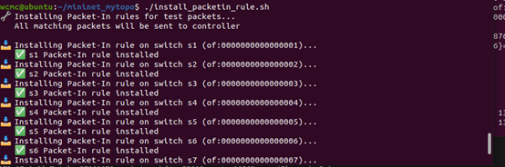
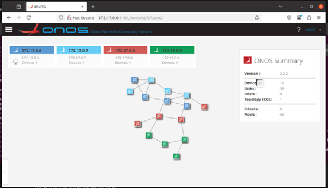
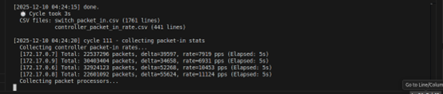
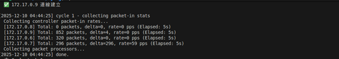
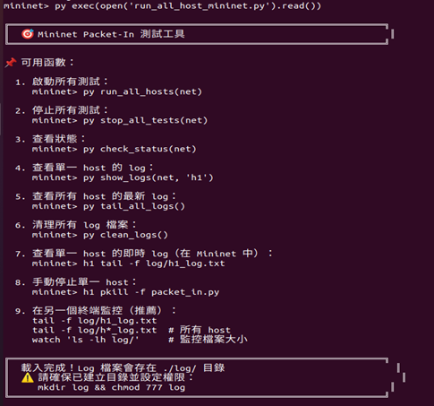
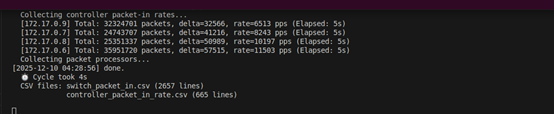
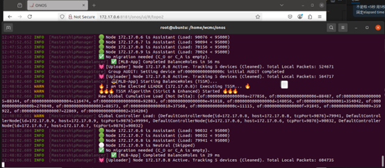

# 02. Full Experiment Workflow

This document records the complete workflow for running experiments on the ONOS multi-controller SDN platform.

---

## Overview

Before starting the experiment, make sure:

- the ONOS cluster has been built successfully
- the target algorithm version has been selected
- the Mininet topology is ready
- the data collection scripts are available

---

## Step 1. Build the ONOS Cluster

Follow the cluster setup document first, and decide which algorithm/image you want to use.

---

## Step 2. Configure Threshold

Default threshold is `10000 packet-in`.

```bash
cfg set org.onosproject.cluster.impl.MastershipManager tssmThreshold 9000
```
### Step 3. Configure Time Period

Default time period is `10 seconds`.  
```bash
cfg set org.onosproject.cluster.impl.MastershipManager tssmTimePeriod 10
```
## Step 4. Optional: Adjust flowPollFrequency
If the system keeps behaving abnormally, after the topology is connected you can enter the ONOS CLI and set:  
```bash
cfg set org.onosproject.provider.of.flow.impl.OpenFlowRuleProvider flowPollFrequency 86400
```
Note:
This may make the packet-in rate unavailable.  
Before using this setting, confirm that packet-in traffic is actually being sent.  
It does not affect controller-switch ownership checking.  

## Step 5. Optional: Adjust LLDP Timing
If the environment is unstable, you may try modifying LLDP timing parameters.
```bash
cfg set org.onosproject.provider.lldp.impl.LldpLinkProvider probeRate 10000
cfg set org.onosproject.provider.lldp.impl.LldpLinkProvider staleLinkAge 60000
cfg set org.onosproject.provider.lldp.impl.LldpLinkProvider maxDiscoveryDelayMs 10000
```
Note:  
This step is optional and usually has limited impact.

## Step 6. Launch the Mininet Topology
Example:sudo python abilene_topo.py

## Step 7. Install Packet-In Rules
After confirming that the topology is connected to ONOS, run your packet-in rule installation script:  

```bash
./install_packetin_rule.sh
```

  
  
The upper figure in the original note refers to packet-in rule installation,
and the lower figure refers to the topology illustration.  

## Step 8. Check ONOS Applications
Make sure the ONOS applications are in the expected state.

## Step 9. Initialize Mastership
After confirming the topology is connected to ONOS, run:
```bash
./init_mastership.sh
```
This script defines the initial mastership scenario.  
Example default scenario:    
each controller manages 4 switches  
Important:  
This step only works if ONOS has already connected to the Mininet topology.  

## Step 10.Start Auto Collection
Run in another terminal:  
```bash
./auto_collect.sh
```
Check whether all controllers show valid data.  
Normal:  
  
Abnormal:  
  
Important:  
If any controller shows total = 0, that means it is not connected properly.  
Press Ctrl + C, stop the script, and run it again until all controllers have valid data.  
If repeated retries still fail:  
delete the existing CSV files first  
then rerun the collection process  
Otherwise, invalid data may accumulate.  

## Step 11. Enter the Mininet CLI
After all settings are ready, enter the Mininet console and execute:  
```bash
py exec(open('run_all_host_mininet.py').read())
```
Or run any custom packet-sending script you prepared.  
  

## Step 12. Run the Experiment
After auto_collect.sh and related tools are ready:  
check the topology one more time  
confirm ONOS has not changed the initial scenario unexpectedly  
execute:  
```bash
py run_all_host(net)
```
 
Expected behavior:  
the numbers should increase continuously  
If the values remain very small (for example, only single digits), check all components again.  
Possible issue:  
flow rules were not successfully installed into the switches  

## Step 13. Check Logs During Experiment Execution
While the experiment is running, use Docker logs to check which controller is the master and whether the algorithm is running correctly.  
Example:  
```bash
docker logs -f onos1
```
  
### You can also check:
```bash
docker logs -f onos2
docker logs -f onos3
docker logs -f onos4
```
This helps verify:  
which controller is acting as master  
whether the algorithm is being executed  
whether system information looks normal  